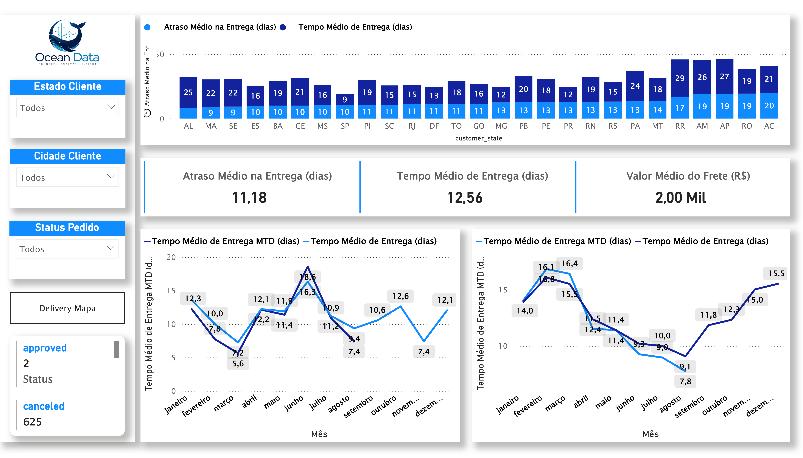
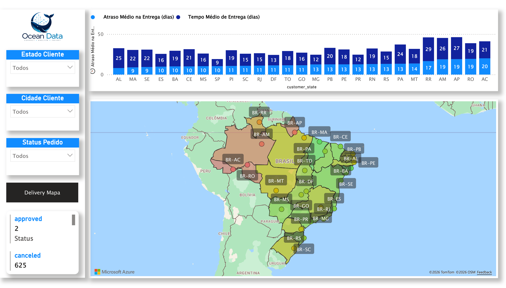
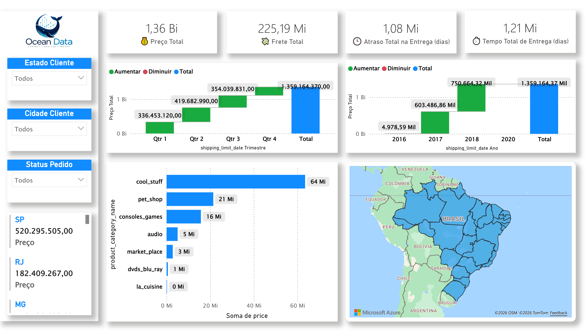
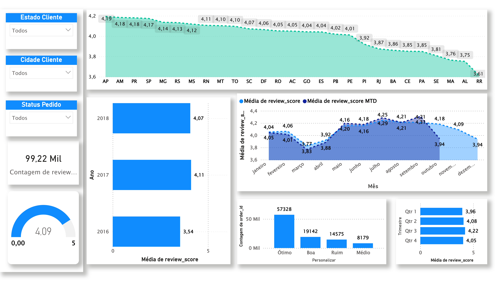
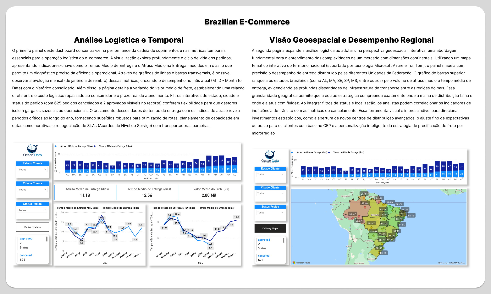
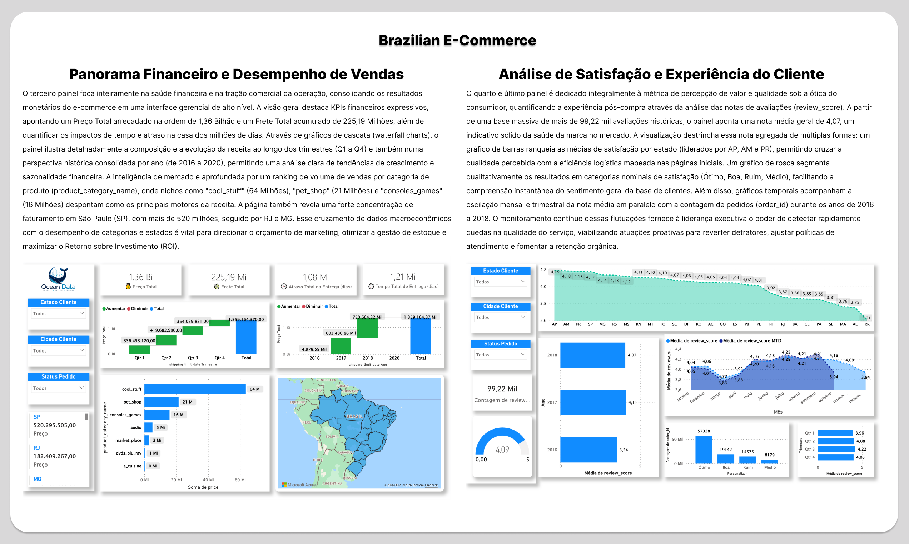

# 🛒 Brazilian E-Commerce — Análise de Dados com Power BI

Dashboard interativo desenvolvido no Power BI para análise do dataset público de e-commerce brasileiro da **Olist**, cobrindo pedidos, produtos, vendedores, pagamentos, avaliações e logística entre 2016 e 2018.

🔗 **[Acesse o Dashboard Online](https://app.powerbi.com/view?r=eyJrIjoiYmZhZDQyYjQtYTNkNC00OTkzLThiZWMtNGI4YmFhMWMyNjA5IiwidCI6IjkwN2IxZDhiLTE2ZTEtNDZiZi05ODczLTI3MjNmNTlmODcwYSJ9)**

---

## 📸 Prévia do Projeto

<br>

| | |
|:---:|:---:|
|  |  |
|  |  |
|  |  |

<br>

---

## 📋 Sobre o Projeto

O dataset da **Olist** é um dos mais completos conjuntos de dados públicos de e-commerce do Brasil. Este projeto transforma esses dados brutos em um painel analítico que permite entender o comportamento de compra, a performance logística, a satisfação dos clientes e a distribuição geográfica das vendas.

**Período analisado:** 2016 – 2018  
**Fonte dos dados:** [Olist — Brazilian E-Commerce Public Dataset (Kaggle)](https://www.kaggle.com/datasets/olistbr/brazilian-ecommerce)

---

## 🗂️ Modelo de Dados

O modelo segue um esquema estrela com **9 tabelas** conectadas via relacionamentos Many-to-One.

### Tabelas

| Tabela | Descrição | Colunas |
|---|---|---|
| `olist_orders_dataset` | Tabela fato central. Contém todos os pedidos com seus status e datas. | 10 |
| `olist_customers_dataset` | Dados dos clientes: cidade, estado e CEP. | 6 |
| `olist_order_items_dataset` | Itens de cada pedido: produto, vendedor, preço e frete. | 13 |
| `olist_order_payments_dataset` | Pagamentos: tipo, parcelas e valor. | 5 |
| `olist_order_reviews_dataset` | Avaliações dos clientes: nota e comentários. | 8 |
| `olist_products_dataset` | Catálogo de produtos: categoria, dimensões e peso. | 9 |
| `olist_sellers_dataset` | Dados dos vendedores: cidade e estado. | 4 |
| `olist_geolocation_dataset` | Coordenadas geográficas por CEP para mapas. | 7 |
| `product_category_name_translation` | Tradução das categorias de produto para inglês. | 2 |

### Diagrama de Relacionamentos

```
olist_customers_dataset
        │ (1)
        │ customer_id
        ▼ (1)
olist_orders_dataset ──(1)──► olist_order_items_dataset ──(Many)──► olist_products_dataset
        │                              │                                      │
        │ (1)                          │ seller_id                            │ product_category_name
        ▼ (Many)                       ▼ (Many)                               ▼ (Many)
olist_order_payments_dataset   olist_sellers_dataset          product_category_name_translation
        
olist_order_reviews_dataset ──(Many)──► olist_orders_dataset
olist_geolocation_dataset (suporte a mapas via CEP)
```

---

## 📐 Colunas Calculadas

Colunas adicionadas durante o tratamento de dados na tabela `olist_orders_dataset`:

| Coluna | Descrição |
|---|---|
| `diff_recive_date` | Diferença em dias entre a data de aprovação e a data de entrega ao cliente. Mede o tempo real de entrega. |
| `order_delevery_date_finish` | Diferença em dias entre a data estimada de entrega e a data real de entrega. Positivo = atraso; negativo = adiantado. |

Colunas de calendário adicionadas em `olist_order_items_dataset`:

| Coluna | Descrição |
|---|---|
| `Ano` | Ano extraído da data limite de envio. |
| `Mês` | Número do mês. |
| `Nome do Mês` | Nome do mês por extenso. |
| `Semana` | Número da semana no ano. |
| `Semana do Mês` | Número da semana dentro do mês. |

---

## 📊 Medidas DAX

Todas as medidas estão organizadas na tabela `Measure`.

| Medida | Fórmula | Descrição |
|---|---|---|
| `avg_diff_reciving` | `AVERAGE(olist_orders_dataset[diff_recive_date])` | Tempo médio geral de entrega (aprovação → recebimento). |
| `avf_date_finish` | `AVERAGE(olist_orders_dataset[order_delevery_date_finish])` | Desvio médio geral entre data estimada e data real de entrega. |
| `meam_avg` | `([avf_date_finish] + [avg_diff_reciving]) / 2` | Média combinada dos dois indicadores de prazo. |
| `target_score` | `5` | Meta de avaliação dos clientes (nota máxima = 5). |
| `Média de diff_recive_date YTD` | `TOTALYTD(AVERAGE(...), order_approved_at.[Date])` | Tempo médio de entrega acumulado no ano (Year-to-Date). |
| `Média de diff_recive_date MTD` | `TOTALMTD(AVERAGE(...), order_approved_at.[Date])` | Tempo médio de entrega acumulado no mês (Month-to-Date). |
| `Média de order_delevery_date_finish MTD` | `TOTALMTD(AVERAGE(...), order_approved_at.[Date])` | Desvio médio de prazo acumulado no mês. |
| `Média de review_score MTD` | `TOTALMTD(AVERAGE(...), review_answer_timestamp.[Date])` | Nota média de avaliação acumulada no mês. |

---

## 🔍 Principais Análises

- **Performance logística** — tempo médio de entrega por estado, desvio em relação ao prazo estimado e evolução mensal/anual (YTD e MTD).
- **Satisfação do cliente** — distribuição das notas de avaliação (1 a 5), meta de score e acompanhamento mensal via `Média de review_score MTD`.
- **Volume de vendas** — pedidos por período, sazonalidade e status dos pedidos (entregue, cancelado, em trânsito etc.).
- **Análise de pagamentos** — participação por tipo de pagamento (cartão de crédito, boleto, voucher, débito) e parcelamento médio.
- **Distribuição geográfica** — mapa de calor de clientes e vendedores por estado e cidade, usando as coordenadas corrigidas do dataset de geolocalização.
- **Análise de produtos** — categorias mais vendidas, relação entre dimensões físicas do produto e custo de frete, e volume de fotos por produto.

---

## 🛠️ Ferramentas e Tecnologias

| Ferramenta | Uso |
|---|---|
| **Power BI Desktop** | Modelagem de dados, criação de medidas DAX e desenvolvimento dos visuais |
| **Power Query (M)** | Tratamento, limpeza e transformação dos dados brutos do CSV |
| **DAX** | Cálculo de métricas de negócio, inteligência de tempo (YTD, MTD) e KPIs |
| **Python / Kaggle** | Origem e exploração inicial do dataset |

---

## 📁 Estrutura do Projeto

```
Brazilian-E-Commerce-PowerBI/
│
├── Brazilian E-Commerce.pbix   # Arquivo principal do Power BI
├── README.md                   # Documentação do projeto
└── images/                     # Screenshots do dashboard
    ├── screenshot_1.png
    ├── screenshot_2.png
    ├── screenshot_3.png
    ├── screenshot_4.png
    ├── screenshot_5.png
    └── screenshot_6.png
```

---

## 🚀 Como Usar

### Visualizar online
Acesse diretamente pelo link:  
👉 **[Brazilian E-Commerce Dashboard](https://app.powerbi.com/view?r=eyJrIjoiYmZhZDQyYjQtYTNkNC00OTkzLThiZWMtNGI4YmFhMWMyNjA5IiwidCI6IjkwN2IxZDhiLTE2ZTEtNDZiZi05ODczLTI3MjNmNTlmODcwYSJ9)**

### Abrir localmente
1. Baixe e instale o [Power BI Desktop](https://powerbi.microsoft.com/pt-br/desktop/) (gratuito).
2. Clone ou baixe este repositório.
3. Abra o arquivo `Brazilian E-Commerce.pbix`.
4. O dataset já está embutido no arquivo (modo Import) — não é necessária nenhuma conexão externa.

---

## 📦 Sobre o Dataset

O **Brazilian E-Commerce Public Dataset by Olist** contém informações reais de ~100 mil pedidos realizados em diversas categorias de produtos, anonimizadas e disponibilizadas publicamente no Kaggle.

| Informação | Detalhe |
|---|---|
| Período | Setembro 2016 – Outubro 2018 |
| Pedidos | ~100.000 |
| Vendedores | ~3.000 |
| Produtos | ~32.000 SKUs |
| Categorias | 73 categorias de produtos |
| Estados cobertos | 27 estados do Brasil |

---

## 👤 Autor

Feito por **Italo Silva**  
📎 [LinkedIn](https://www.linkedin.com/in/italo-silva) | 💻 [GitHub](https://github.com/italo-silva)

---

## 📄 Licença

Dataset original licenciado sob [CC BY-NC-SA 4.0](https://creativecommons.org/licenses/by-nc-sa/4.0/) pela Olist.  
Este projeto (análise e dashboard) é de uso livre para fins educacionais e de portfólio.
